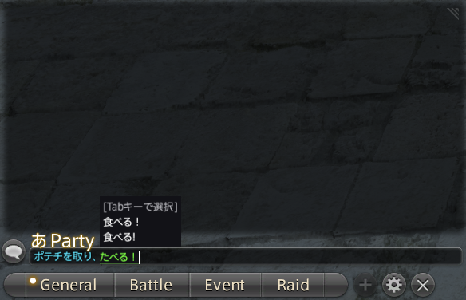

# FFXIV IME Bridge

Type Japanese in the Final Fantasy XIV chat box on Linux, using fcitx5.

A Dalamud plugin. It shows what you are composing, candidate list included,
right in the game's own chat box, and places the finished text there for you
to send with Enter.



## Why

On Linux the game runs under Wine. When `XMODIFIERS` points Wine at fcitx5,
the game window gets fcitx5's own composition window: Japanese can be typed,
but what you are composing and the candidates float in a corner of the
screen, away from the chat box, instead of appearing where you type.

This plugin does not go through Wine for this. It talks to fcitx5
directly over D-Bus, sends it the keys you type into the chat box, draws the
composition and candidates itself, and writes the committed text into the
chat box. It never sends chat; Enter is still yours.

## Requirements

- **Linux**, with **fcitx5** running on your session bus.
- **Mozc** installed (the `fcitx5-mozc` package on most distributions) and
  added to fcitx5's input method group (fcitx5 Configuration → Input Method).
  The plugin checks for it when it loads and stays off without it.
- **XIVLauncher.Core** with **Dalamud at API 15**.

On Windows the plugin loads and does nothing.

### Keep fcitx5's XIM away from the game

If `XMODIFIERS` is set in your environment (`@im=fcitx`, as the Arch wiki's
fcitx5 setup does), Wine connects the game window to fcitx5 over XIM, and
fcitx5 then takes your keys before the plugin sees them: Ctrl+Space switches
fcitx5's own popup to Mozc instead of the plugin, and the Indicator stays `A`.
In XIVLauncher, open **Settings → Troubleshooting** and tick **Hack:
XMODIFIERS="@im=null"**. This applies to the game only. Every other app keeps
fcitx5. If `XMODIFIERS` is set, the plugin says so in chat when it loads.

`GTK_IM_MODULE` and `QT_IM_MODULE` don't matter to the game; leave them as
they are.

## Install

1. In game, open **Dalamud Settings** (or `/xlsettings`) → **Experimental**
   → *Custom Plugin Repositories*, and add this URL:

   ```
   https://raw.githubusercontent.com/niku-0/ffxiv-ime-bridge/main/repo.json
   ```

   Click the **+** next to it, tick **Enabled**, then **Save** at the bottom.
2. Open **Dalamud Plugins** (or `/xlplugins`), search for **FFXIV IME
   Bridge** and install it.

When it loads, chat says `IME Bridge: fcitx5 reachable, forwarding off` (on
later loads, forwarding is as you left it). If it says `fcitx5 not reachable,
disabled` instead, see [Troubleshooting](#troubleshooting).

## Use

1. Click into the chat box.
2. Press the **Toggle Key**: `Alt` + the key left of `1` by default (`Alt+§`
   on a Nordic layout, ``Alt+` `` on US). Chat says `IME Bridge: forwarding
   on` and the Indicator appears left of the channel name.
3. The Indicator shows `A` at first: the plugin's input starts on your
   keyboard layout, like any new fcitx5 window. Switch to Mozc with fcitx5's
   own switch key (Ctrl+Space by default); it turns to `あ`. If it stays
   `A` and fcitx5's own popup appears instead, see [Keep fcitx5's XIM away
   from the game](#keep-fcitx5s-xim-away-from-the-game); otherwise check
   that key under fcitx5 Configuration → Global Options.
4. Type. The composition appears at the cursor with Mozc's candidates.
   Space converts, the arrow keys and Space move through candidates, and a
   click on a candidate picks it. Enter commits the text into the chat box.
5. Press Enter again to send, as always.

Clicking out of the chat box or alt-tabbing away cancels a composition that
is not committed yet. Text that would not fit the chat box's limit (500
bytes, about 166 Japanese characters) is refused rather than cut off, and
chat tells you by how much.

**Toggle Key.** It only acts while the chat box is focused, and the game
never sees it. It is matched by the key's position on the keyboard, not by
the character it types, so the default names the same physical key on any
layout. To rebind it, open the settings (the cog on the plugin's
`/xlplugins` entry, or `/imebridge`), press **Press a key** and then the new
chord. It needs at least one of Ctrl, Alt or Shift.

**Slash commands.** While the chat box is empty, a `/` and the command word
after it go to the game untouched, so `/tell Name` and then Japanese work
without toggling off. A `/` in the middle of text is ordinary text.

**The Indicator**, shown while the chat box is focused and forwarding is on:

| Glyph | Meaning |
| --- | --- |
| `あ` | Mozc in hiragana: your typing is composed as Japanese. |
| `A` | Your keyboard layout, or Mozc on direct input: letters go into the chat box as typed. |
| `!` | Degraded: fcitx5 is gone or not answering, so keys go to the game untouched. See below. |

Mozc's katakana shows `ア` (`ｱ` half-width), its half- and full-width
alphanumeric modes `半` and `全`, and any other fcitx5 input method shows its
initial. The key left of `1` pressed on its own is Mozc's Hankaku/Zenkaku: it
flips Mozc between hiragana and direct input. Mozc's mode is read from
fcitx5's tray icon, so on a desktop without a tray the Indicator shows `あ` for
Mozc in every mode. The settings window can hide the Indicator, or draw it as
the Windows client's badge instead.

## Troubleshooting

**`IME Bridge: fcitx5 not reachable, disabled`.** The plugin could not reach
fcitx5 when it loaded and is switched off. Run `/imebridge probe`: it tests the
connection again without changing anything and prints where it stopped, for
example `Ladder stopped at: input-method`, which means Mozc is missing from
fcitx5's input method group. `/imebridge debug` opens the debug window, whose
**Transport** tab lists every step with its details. Once fixed, run
`/imebridge reconnect` (or **Reconnect** in the settings). Clicking into the
chat box also reconnects by itself, at most every ten seconds.

**The Indicator shows `!`.** Forwarding is Degraded: fcitx5 quit, restarted or
stopped answering, and your keys go to the game as if forwarding were off.
Chat said which when it happened. Forwarding stays on underneath and comes
back by itself once fcitx5 is running again and you click into the chat box.
After `lost the connection to fcitx5` it needs `/imebridge reconnect`.

**Commands.** `/imebridge` (or `/ime`) opens the settings. `/imebridge toggle
[on|off]`, `indicator [on|off]`, `reconnect`, `probe` and `debug` do what
they say; `/xlhelp` lists them too.

**Reporting a problem.** Open an issue on GitHub with the bug report template.
It asks for the ladder from the debug window's **Copy ladder** button (on the
**Transport** tab, home folder already shortened to `~`), your setup, and what
you typed and what appeared. Please don't attach `dalamud.log` unless asked:
it can contain your chat.

## Tested on

- wine-xiv-staging 10.8, through XIVLauncher.Core with Dalamud 15
- KDE Plasma on Wayland
- fcitx5 with Mozc, Nordic keyboard layout

That is one setup. Other Wine and Proton builds, desktops and input methods
are unverified, and reports are welcome. The plugin reaches D-Bus from inside
Wine through a Unix socket, which works on the build above and may not
everywhere. That socket is the first rung of a planned ladder of ways in; the
next, a small native helper process, gets built once a report shows the first
one failing.

## AI assistance

This plugin was developed with AI assistance, and every behavioural claim in
this repository was verified in-game. The tickets under `.scratch/` are that
record.

Building from source: [`docs/dev-plugin.md`](docs/dev-plugin.md).

## Licence

[MIT](LICENSE), © niku-0.
